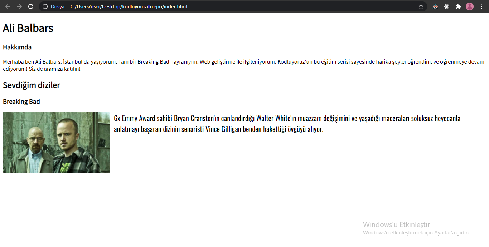
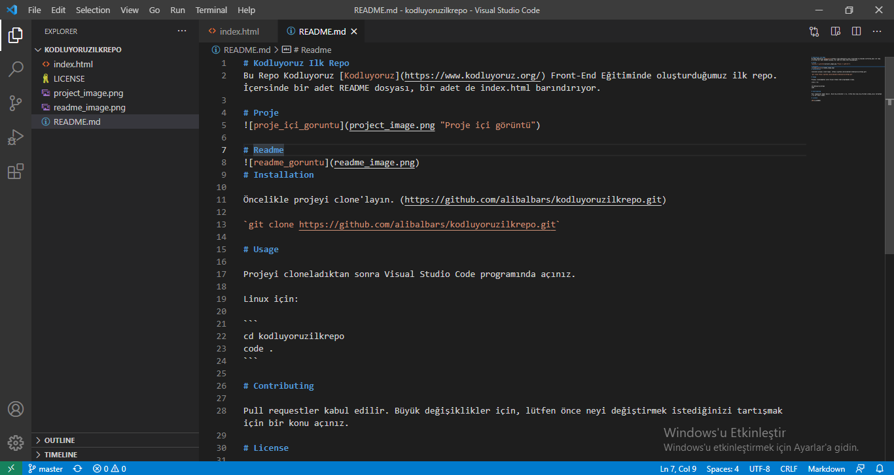

# Kodluyoruz Ilk Repo
Bu Repo Kodluyoruz [Kodluyoruz](https://www.kodluyoruz.org/) Front-End Eğitiminde oluşturduğumuz ilk repo. İçersinde bir adet README dosyası, bir adet de index.html barındırıyor.

# Proje içi görüntü


# Readme görüntü

# Installation 

Öncelikle projeyi clone'layın. (https://github.com/alibalbars/kodluyoruzilkrepo.git)

`git clone https://github.com/alibalbars/kodluyoruzilkrepo.git`

# Usage

Projeyi cloneladıktan sonra Visual Studio Code programında açınız.

Linux için:

```
cd kodluyoruzilkrepo
code .
```

# Contributing

Pull requestler kabul edilir. Büyük değişiklikler için, lütfen önce neyi değiştirmek istediğinizi tartışmak için bir konu açınız.

# License

[MIT](LICENSE)
